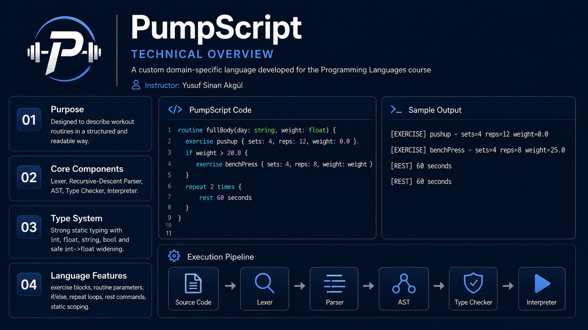

# PumpScript


PumpScript is a small domain-specific language (DSL) designed to express workout routines in a safe, readable, and semantically constrained form. The implementation is written in Python without external parsing libraries. It consists of a hand-written lexer, a recursive-descent parser, a class-based Abstract Syntax Tree (AST), a two-pass static type checker, and a tree-walking interpreter.

## Key Features

- **Lexical Analysis:** Hand-written lexer supporting tokens, comments, and line tracking.
- **Recursive-Descent Parsing:** Builds an EBNF-aligned AST structure.
- **Static Typing:** Supports `int`, `float`, `string`, and `bool`. Validates routine signatures, fields, and expressions.
- **Domain-Specific Constructs:**
  - `routine`: Defines a parameterized workout procedure.
  - `exercise`: Creates a workout record with a strict predefined field schema (`sets`, `reps`, `weight`, `group`, `completed`).
  - `rest N seconds`: Represents a domain-specific rest instruction.
  - `repeat N times`: Executes a block a fixed number of times.
  - `if/else`: Control flow using Boolean conditions.
- **Static Scoping:** Global routines and local parameter environments.
- **Tree-Walking Interpreter:** Executes the AST directly.

## Example

```pump
routine chest_day(sets: int) {
  exercise bench_press {
    sets: sets
    reps: 10
    weight: 80.0
    group: "chest"
    completed: false
  }
  rest 60 seconds
}

chest_day(4)
```

## Documentation

For a deep dive into the technical design, lexical and syntactic rules, AST structure, static type system, and interpreter semantics, please refer to the included **Technical Design Document**: `PumpScript_Technical_Design_Document_EN.pdf`.

## Assignment Parts

The repository contains the project separated into two assignment deliverables:
- **`pumpscript_part1/`**: Contains the first part of the assignment along with its related PDF documentation and zip resources.
- **`pumpscript_part2/`**: Contains the second part of the assignment with its corresponding PDF documentation and zip resources.
